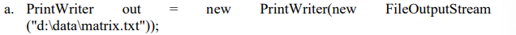
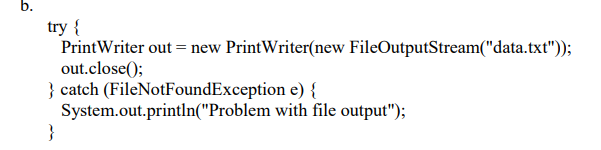
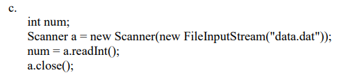
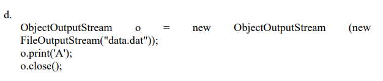

# Tutorial 7
1.
#a
```java
import java.io.FileWriter;
import java.io.PrintWriter;
import java.util.Random;

public class TextFileWrite{
    public static void main(String[]args)throws Exception{
        Random rd= new Random();
        PrintWriter out = new PrintWriter(new FileWriter("integer.txt"));

    for(int i=0; i<10; i++){
        out.println(rand.nextInt(1001));
    }
    out.close();
    }
}
#b
```java
import java.io.File;
import java.util.Scanner;

public class TextFileRead{
    public static void main(String[]args) throws Exception{
        Scanner sc = new Scanner(new File("integer.txt"));
        int max = Integer.MIN_VALUE;

        while(sc.hasNextInt()){
            int num = sc.nextInt();
            System.out.println(num);
            if(num>max){
                max=num;
            }
        }
    System.out.println(" Largest integer: "+max);
    sc.close();
    }
}
#c 
```java
import java.io.File;
import java.io.DatatOutputStream;
import java.io.FileOutputStream;
import java.util.Random;

public class BinaryFileWrite{
    public static void main(String[] args) throws Exception{
        Random rd = new Random();
        File f = new File("integer.dat");
        FileOutputStream fos = new FileOutputStream(f);
        DataOutputStream out = new DataOutputStream(fos);

    for(int i=0; i<10; i++){
        out.writeInt(rd.nextInt(1001));
    }
        out.close();
    }
}
#d
```java
import java.io.File;
import java.io.FileInputStream;
import java.io.DataInputStream;

public class BinaryFileRead{
    public static void main(String[] args) throws Exception{
        File f = new File("integer.dat");
        FileInputStream fis = new FileInputStream(f);
        DataInputStream in = new DataInputStream(fis);

        int sum=0;
        int count=0;
    System.out.println(" Integers in the file ");
        
        while(in.available()>0){
            int num = in.readInt();
            System.out.println(num);
            sum += num;
            count++;
        }
            double average =(double)sum/count;
            System.out.println(" Average: " + average);
        in.close();
    }
}
2.
#a //(corrected version)
```java
PrintWriter out = new PrintWriter(new File("data.txt"));
//or
PrintWriter out = new PrintWriter(new FileOutputStream("d:\\data\\matrix.txt"));
//or
PrintWriter out = new PrintWriter(new FileOutputStream("d:/data/matrix.txt"));
#b //
```java
try{
    PrintWriter out= new PrintWriter(new FileOutputStream("data.txt"));
    out.close();
} catch(FileNotFoundException e){
System.out.println(" Problem with file output ");
}
#c//
```java
int num;
Scanner a = new Scanner(new FileInputStream("data.dat"));
num=a.nextInt();
a.close();
#d//
```java
ObjectOutputStream o = new ObjectOutputStream(new FileOutputStream("data.dat"));
o.WriteChar('A');
o.close();
3.
```java
import java.io.*;
public class SentenceIntoBinary{
    public static void main(String[] args) throws Exception{
       
       String sentence = " I have a dream to become an AI engineer ";
       FileOutputStream f = new FileOutputStream("data.txt");
        PrintWriter out = new PrintWriter(f);
        
    for(int i=0; i<sentence.length(); i++ ){
        int ascii = sentence.charAt(i);
        String bin = String.format("%8s",Integer.toBinaryString(ascii)).replace(' ','0');
        out.print(bin + " ");
    }
    out.close();
        Scanner sc = new Scanner(new FileInputStream("data.txt"));
        System.out.println("Binary stored in file: ");
        while(sc.hasNext()){
            System.out.print(sc.next()+ " ");
        }
        sc.close();
        }
    }

